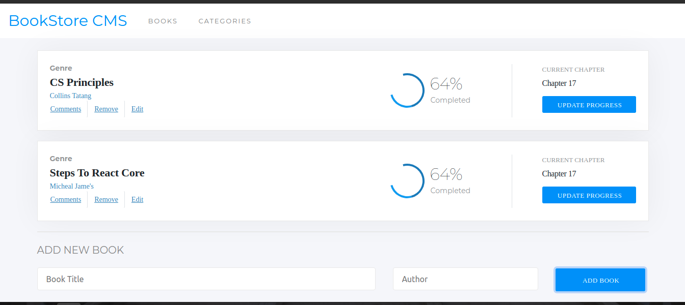

# Bookstore



## Learning objective
- Understand the concept of state management.
- Use store, actions and reducers in React.
- Connect React and Redux.
- Connect an existing API via Redux and use the data to display something in a UI.
- Apply React best practices and language style guides in code.
  
### Project requirements
- Use Gitflow in managing the project branch.
- Initialise React app and add React Redux (npm install react-redux)..
- Use the ducks pattern for your Redux files/folder structure.
- The building blocks of your app should be set as re-usable components.
- Add React Router and set two Routes and Links for the app's navigation.
- Configuring the Redux Store (/src/redux/configureStore.js) and importing the necessary methods from Redux
- Write your book's actions and reducer (in /src/redux/books/books.js)
- In your React component responsible for removing books - implement that even by dispatching a corresponding action.
- Read the [Bookstore API documentation](https://www.notion.so/Bookstore-API-51ea269061f849118c65c0a53e88a739) to learn how to use the API.
- Refactor your *add book* and *remove book* features to persist your changes in the server.
- You will find all the details of the Bookstore design in Zeplin.
- Use the information detailed in Zeplin to style the website.
  
========

## Built With

- React.Js
- Redux
## Getting Started

To get a local copy up and running follow these simple example steps.

### Prerequisites

- NodeJS - [v16.x](https://nodejs.org/en/)

### Setup

```bash
git clone https://github.com/CollinsTatang/Bookstore-App.git
cd ./Bookstore-App
```

### Install

```bash
npm install
```

### Usage

```bash
npm start
```

### Build

```bash
npm run build
```

### Run tests

```bash
npm test
```

## Authors

👤**Makungong Collins Tatang**

- GitHub: [@CollinsTatang1](https://github.com/CollinsTatang)
- Twitter: [@CollinsTatang1](https://twitter.com/CollinsTatang1)
- LinkedIn: [Makungong Collins](https://www.linkedin.com/in/makungong-collins/)

## 🤝 Contributing

Contributions, issues, and feature requests are welcome!

Feel free to check the [issues page](../../issues/).

## Show your support

Give a ⭐️ if you like this project!

## Acknowledgments

- Microverse
- [Microverse design team](https://app.zeplin.io/project/5b35a9e13227086040f8eb75/screen/5b695e29bb8c844f118f9378)

## 📝 License

This project is [MIT](./LICENSE) licensed.